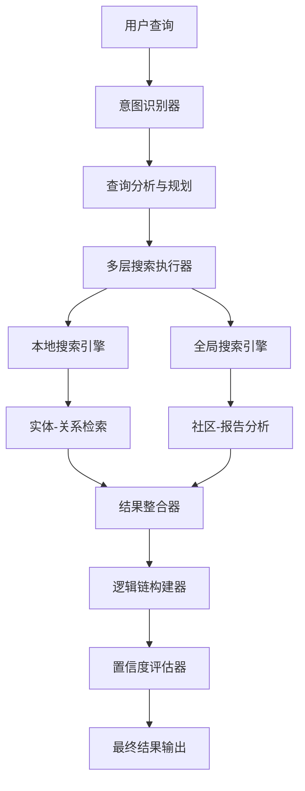

# DeepSearch 快速入门指南

## 🚀 什么是 DeepSearch

DeepSearch 是 GraphRAG 项目的最新高级搜索功能，具备以下核心特性：

- **🎯 路径控制**: 智能规划和控制搜索的深度与方向
- **🔍 逻辑链可视化**: 完整的搜索过程透明化
- **🚀 多搜索融合**: 结合本地搜索和全局搜索的优势
- **📊 置信度评估**: 动态评估搜索质量和结果可靠性
- **⚡ 自适应深度**: 根据置信度阈值自动调整搜索深度

## 📦 安装要求

确保您已经安装了 GraphRAG 项目：

```bash
git clone https://github.com/microsoft/graphrag.git
cd graphrag
pip install -e .
```

## 🔧 详细配置说明

### 1. 核心配置参数

在您的 `settings.yaml` 中添加 DeepSearch 配置：

```yaml
deep_search:
  # 核心搜索控制参数
  max_depth: 3                    # 最大搜索深度 (1-5)
  confidence_threshold: 0.7       # 置信度阈值 (0.0-1.0)
  use_local_search: true         # 启用本地搜索
  use_global_search: true        # 启用全局搜索
  use_drift_search: true         # 启用DRIFT搜索 (动态推理搜索)
  enable_path_visualization: true # 启用路径可视化
  enable_logic_chain: true       # 启用逻辑链追踪
```

#### 核心参数详解

| 参数 | 默认值 | 作用 | 为什么这样设置 |
|------|--------|------|----------------|
| `max_depth` | 3 | 控制搜索的最大层数 | 平衡搜索深度与性能。3层足以处理大多数复杂查询，超过5层会导致过度搜索和延迟 |
| `confidence_threshold` | 0.7 | 当置信度达到阈值时停止搜索 | 0.7是高质量结果的经验阈值，低于此值可能信息不充分，高于此值则要求过严 |
| `use_local_search` | true | 是否启用实体级精确搜索 | 提供具体事实和细节信息，适合回答"谁、什么、何时"类问题 |
| `use_global_search` | true | 是否启用社区级模式搜索 | 发现高层次模式和主题，适合回答"为什么、如何"类问题 |
| `use_drift_search` | true | 是否启用DRIFT动态推理搜索 | 结合全局和局部搜索优势，通过动态扩展提供平衡的成本与质量 |
| `enable_path_visualization` | true | 是否生成可视化路径数据 | 提供搜索过程的透明度，帮助理解和调试搜索逻辑 |
| `enable_logic_chain` | true | 是否记录详细推理链 | 跟踪每步推理过程，支持结果可解释性和问题诊断 |

### 2. 本地搜索参数详解

```yaml
deep_search:
  # 本地搜索详细配置
  local_search_text_unit_prop: 0.9      # 文本单元权重比例
  local_search_community_prop: 0.1      # 社区信息权重比例  
  local_search_top_k_mapped_entities: 10 # 映射实体数量
  local_search_top_k_relationships: 10   # 关系数量限制
  local_search_max_data_tokens: 12000    # 最大数据token数
```

#### 本地搜索参数说明

| 参数 | 作用 | 优化建议 |
|------|------|----------|
| `local_search_text_unit_prop` | 控制原始文本在搜索中的权重 | 游戏数据分析建议0.8-0.9，重视原始数据的准确性 |
| `local_search_community_prop` | 控制社区上下文的权重 | 设为0.1-0.2，提供适度的背景信息而不影响精确性 |
| `local_search_top_k_mapped_entities` | 限制相关实体数量 | 游戏分析建议10-15，平衡相关性和计算效率 |
| `local_search_top_k_relationships` | 限制关系数量 | 保持与实体数相近，确保关系图的完整性 |
| `local_search_max_data_tokens` | 控制上下文长度 | 12000适合详细分析，快速查询可降至8000 |

### 3. 全局搜索参数详解

```yaml
deep_search:
  # 全局搜索详细配置
  global_search_max_data_tokens: 8000    # 全局搜索数据token限制
  global_search_map_max_length: 1000     # Map阶段最大长度
  global_search_reduce_max_length: 2000  # Reduce阶段最大长度
```

#### 全局搜索参数说明

| 参数 | 作用 | 游戏数据场景优化 |
|------|------|-----------------|
| `global_search_max_data_tokens` | 控制社区报告的总长度 | 8000适合中等规模游戏数据，大型数据集可增至12000 |
| `global_search_map_max_length` | 单个社区报告摘要长度 | 1000字可充分描述玩家群体特征和行为模式 |
| `global_search_reduce_max_length` | 最终整合报告长度 | 2000字适合执行摘要，详细报告可增至4000 |

### 3.5 DRIFT搜索参数详解

DRIFT (Dynamic Reasoning and Inference with Flexible Traversal) 搜索是GraphRAG的高级搜索方法，结合了全局和局部搜索的优势。

```yaml
# 完整的DRIFT搜索配置
drift_search:
  # 核心DRIFT参数
  chat_model_id: "chat"                # 聊天模型ID
  embedding_model_id: "embedding"     # 嵌入模型ID
  prompt: "prompts/drift_search_system_prompt.txt"       # 系统提示文件
  reduce_prompt: "prompts/drift_search_reduce_prompt.txt" # 汇总提示文件
  
  # 数据和token控制
  data_max_tokens: 12000              # 数据最大token数
  reduce_max_tokens: 8000             # 汇总阶段最大token数
  reduce_temperature: 0.0             # 汇总阶段温度参数
  reduce_max_completion_tokens: 4000  # 汇总完成最大token数
  
  # 并发和性能控制
  concurrency: 32                     # 并发请求数量
  
  # DRIFT特有参数
  drift_k_followups: 20               # 后续查询的K值
  primer_folds: 5                     # 启动器折叠数
  primer_llm_max_tokens: 12000        # 启动器LLM最大token数
  n_depth: 3                          # DRIFT搜索深度
  
  # 本地搜索集成参数
  local_search_text_unit_prop: 0.9    # 文本单元权重
  local_search_community_prop: 0.1    # 社区信息权重
  local_search_top_k_mapped_entities: 10      # 映射实体数量
  local_search_top_k_relationships: 10        # 关系数量
  local_search_max_data_tokens: 12000         # 本地搜索最大token数
  local_search_temperature: 0.0               # 本地搜索温度
  local_search_top_p: 1.0                     # 本地搜索top_p
  local_search_n: 1                           # 本地搜索候选数

# 在deep_search中启用DRIFT
deep_search:
  use_drift_search: true              # 启用DRIFT搜索
  drift_integration_weight: 0.3       # DRIFT结果在最终结果中的权重
```

#### DRIFT搜索参数详解

| 参数类别 | 参数名称 | 默认值 | 作用说明 | 游戏数据优化建议 |
|---------|----------|--------|----------|-----------------|
| **核心控制** | `n_depth` | 3 | DRIFT搜索的递归深度 | 游戏分析建议2-4，平衡深度与性能 |
| **并发控制** | `concurrency` | 32 | 并发处理的请求数量 | 根据API限制调整，游戏数据可用16-64 |
| **查询扩展** | `drift_k_followups` | 20 | 生成的后续查询数量 | 复杂游戏分析可增至30-50 |
| **启动控制** | `primer_folds` | 5 | 启动器的数据分折数 | 大型游戏数据集可增至8-10 |
| **Token管理** | `data_max_tokens` | 12000 | 数据处理的最大token数 | 游戏数据建议8000-15000 |
| **结果汇总** | `reduce_max_tokens` | 8000 | 结果汇总的最大token数 | 详细报告可增至12000-16000 |

#### DRIFT搜索工作原理

```
DRIFT搜索三阶段流程:

第一阶段: Primer (启动器)
┌─────────────────────────────────────────────────────┐
│ 1. 查询与社区报告语义匹配                             │
│ 2. 生成初始答案和后续问题                             │
│ 3. 评估置信度决定是否继续                             │
└─────────────────────────────────────────────────────┘
                        ↓
第二阶段: Follow-Up (深入探索)  
┌─────────────────────────────────────────────────────┐
│ 1. 基于后续问题执行局部搜索                           │
│ 2. 收集细粒度信息补充初始答案                         │
│ 3. 动态调整搜索方向和深度                             │
└─────────────────────────────────────────────────────┘
                        ↓
第三阶段: Reduce (结果整合)
┌─────────────────────────────────────────────────────┐
│ 1. 整合所有搜索阶段的结果                             │
│ 2. 生成层次化的答案结构                               │
│ 3. 平衡全局洞察和局部细节                             │
└─────────────────────────────────────────────────────┘
```

#### 为什么选择DRIFT搜索

**优势对比:**

| 搜索方法 | 全局视角 | 局部细节 | 成本效率 | 适用场景 |
|---------|----------|----------|----------|----------|
| **Local Search** | ❌ 弱 | ✅ 强 | ✅ 高 | 具体事实查询 |
| **Global Search** | ✅ 强 | ❌ 弱 | ⚠️ 中等 | 模式和趋势分析 |
| **DRIFT Search** | ✅ 强 | ✅ 强 | ⚠️ 中等 | 复杂综合分析 |
| **Deep Search** | ✅ 强 | ✅ 强 | ❌ 低 | 最高质量分析 |

**DRIFT搜索的独特价值:**
- **成本控制**: 相比Deep Search更经济，相比单一方法更全面
- **动态调整**: 根据查询复杂度自适应调整搜索策略
- **层次化结果**: 提供从宏观到微观的分层信息
- **可扩展性**: 支持大规模游戏数据的高效处理

### 4. LLM配置参数

```yaml
deep_search:
  # LLM行为控制
  max_tokens: 8000           # 模型最大输出token数
  temperature: 0.0           # 输出随机性 (0.0-1.0)
  top_p: 1.0                # 核采样参数
  n: 1                      # 生成候选数量
  
  # 模型选择
  chat_model_id: "chat"         # 聊天模型ID
  embedding_model_id: "embedding" # 嵌入模型ID
```

#### LLM参数优化指南

| 参数 | 推荐值 | 游戏分析场景说明 |
|------|--------|-----------------|
| `temperature` | 0.0-0.2 | 游戏数据分析需要一致性和准确性，低温度确保稳定输出 |
| `max_tokens` | 8000-12000 | 足够长度生成详细的分析报告和建议 |
| `top_p` | 0.9-1.0 | 保持较高值以获得完整的词汇表达能力 |

### 5. 高级调优配置

#### 性能优化配置
```yaml
deep_search:
  # 快速查询模式 (适用于实时仪表板)
  max_depth: 2
  confidence_threshold: 0.6
  local_search_max_data_tokens: 8000
  global_search_max_data_tokens: 6000
  max_tokens: 6000
```

#### 深度分析配置
```yaml
deep_search:
  # 详细分析模式 (适用于专业报告)
  max_depth: 5
  confidence_threshold: 0.8
  local_search_max_data_tokens: 15000
  global_search_max_data_tokens: 12000
  max_tokens: 12000
  enable_intent_recognition: true  # 启用意图识别
```

#### 游戏专用配置
```yaml
deep_search:
  # 游戏数据分析专用设置
  max_depth: 4
  confidence_threshold: 0.75
  game_mode: true                  # 启用游戏模式优化
  local_search_top_k_mapped_entities: 15  # 适应复杂玩家关系
  enable_intent_recognition: true  # 智能识别分析意图
```

## 🎯 使用方法

### 命令行使用

```bash
# 基础深度搜索 (使用所有可用搜索方法)
graphrag query --method deep --query "数据中的主要主题是什么？"

# 仅使用DRIFT搜索 (平衡成本与质量)
graphrag query --method drift --query "玩家流失的主要原因分析"

# 深度搜索 + DRIFT增强
graphrag query --method deep --query "实体之间如何关联？" --streaming

# DRIFT搜索与自定义响应类型
graphrag query --method drift --query "游戏平衡性问题分析" --response-type "详细报告"

# 比较不同搜索方法
graphrag query --method local --query "高价值玩家特征"   # 快速事实查询
graphrag query --method global --query "高价值玩家特征"  # 社区模式分析  
graphrag query --method drift --query "高价值玩家特征"   # 平衡分析
graphrag query --method deep --query "高价值玩家特征"    # 最全面分析
```

### Python API 使用

```python
import asyncio
import pandas as pd
import graphrag.api as api
from graphrag.config.load_config import load_config

async def run_deep_search_example():
    # 加载配置
    config = load_config("./")
    
    # 加载数据
    entities = pd.read_parquet("output/entities.parquet")
    communities = pd.read_parquet("output/communities.parquet")
    community_reports = pd.read_parquet("output/community_reports.parquet")
    text_units = pd.read_parquet("output/text_units.parquet")
    relationships = pd.read_parquet("output/relationships.parquet")
    
    # 执行深度搜索 (包含DRIFT)
    response, context_data = await api.deep_search(
        config=config,
        entities=entities,
        communities=communities,
        community_reports=community_reports,
        text_units=text_units,
        relationships=relationships,
        query="数据中出现的主要模式是什么？",
        response_type="详细分析"
    )
    
    # 或者直接使用DRIFT搜索
    drift_response, drift_context = await api.drift_search(
        config=config,
        entities=entities,
        communities=communities,
        community_reports=community_reports,
        text_units=text_units,
        relationships=relationships,
        community_level=2,
        query="玩家行为模式分析",
        response_type="详细报告"
    )
    
    print("响应:", response)
    print("搜索深度:", context_data.get("search_depth", 0))
    print("路径数量:", context_data.get("path_count", 0))
    print("总体置信度:", context_data.get("total_confidence", 0))
    
    # 分析逻辑链
    logic_chain = context_data.get("logic_chain", {})
    if logic_chain:
        print("\n逻辑链摘要:")
        paths = logic_chain.get("paths", [])
        for i, path in enumerate(paths):
            print(f"  步骤 {i+1}: {path.get('search_type')} 搜索 "
                  f"(置信度: {path.get('confidence', 0):.2f})")

# 运行示例
asyncio.run(run_deep_search_example())
```

### 流式搜索

```python
async def stream_search_example():
    print("=== Deep Search 流式输出 ===")
    async for chunk in api.deep_search_streaming(
        config=config,
        entities=entities,
        communities=communities,
        community_reports=community_reports,
        text_units=text_units,
        relationships=relationships,
        query="分析关系模式",
    ):
        print(chunk, end="", flush=True)
    
    print("\n\n=== DRIFT Search 流式输出 ===")
    async for chunk in api.drift_search_streaming(
        config=config,
        entities=entities,
        communities=communities, 
        community_reports=community_reports,
        text_units=text_units,
        relationships=relationships,
        community_level=2,
        query="游戏平衡性分析",
        response_type="分析报告"
    ):
        print(chunk, end="", flush=True)

asyncio.run(stream_search_example())
```

### 搜索方法对比示例

```python
async def compare_search_methods():
    """对比不同搜索方法的结果和性能"""
    
    query = "高价值玩家的付费行为特征"
    
    search_methods = {
        "local": api.local_search,
        "global": api.global_search, 
        "drift": api.drift_search,
        "deep": api.deep_search
    }
    
    results = {}
    
    for method_name, search_func in search_methods.items():
        start_time = time.time()
        
        if method_name == "drift":
            response, context = await search_func(
                config=config,
                entities=entities,
                communities=communities,
                community_reports=community_reports,
                text_units=text_units,
                relationships=relationships,
                community_level=2,
                query=query,
                response_type="分析报告"
            )
        else:
            response, context = await search_func(
                config=config,
                entities=entities,
                communities=communities,
                community_reports=community_reports,
                text_units=text_units,
                relationships=relationships,
                query=query
            )
        
        execution_time = time.time() - start_time
        
        results[method_name] = {
            "response": response,
            "execution_time": execution_time,
            "confidence": context.get("total_confidence", 0),
            "context_size": len(str(response))
        }
    
    # 结果对比
    print("=== 搜索方法性能对比 ===")
    for method, result in results.items():
        print(f"{method.title()} Search:")
        print(f"  执行时间: {result['execution_time']:.2f}秒")
        print(f"  置信度: {result['confidence']:.2f}")
        print(f"  响应长度: {result['context_size']} 字符")
        print(f"  响应预览: {result['response'][:100]}...")
        print()

asyncio.run(compare_search_methods())
```

## 🌐 Web 界面与可视化Demo

### 1. 启动 Unified Search App

```bash
cd unified-search-app
streamlit run app.py
```

### 2. 启用 Deep Search

在侧边栏中勾选 "Include deep search" 选项

### 3. 逻辑链可视化界面完整演示

DeepSearch的核心优势在于完全透明的逻辑推理过程。以下是实际可视化界面的详细展示：

#### 3.1 搜索路径流程图

当您执行一个深度搜索时，系统会生成如下的可视化路径图：

```
查询: "高价值玩家的付费转化路径是什么？"

搜索路径可视化:
┌─────────────┐    ┌─────────────┐    ┌─────────────┐    ┌─────────────┐
│  步骤 1     │───▶│  步骤 2     │───▶│  步骤 3     │───▶│  最终整合   │
│  Local 搜索 │    │ Global 搜索 │    │ Local 搜索  │    │  推理结果   │
│  置信度:0.8 │    │ 置信度:0.75 │    │ 置信度:0.85 │    │ 置信度:0.82 │
│  🔵 实体层  │    │  🟠 社区层  │    │  🔵 关系层  │    │  🔴 综合   │
└─────────────┘    └─────────────┘    └─────────────┘    └─────────────┘
```

#### 3.2 置信度变化趋势图

```
置信度分析图表:

1.0 ┤                                    ╭── 最终置信度: 0.82
0.9 ┤           ╭─────╮              ╭──╯
0.8 ┤      ╭────╯     ╰──╮        ╭─╯     🔵 Local Search
0.7 ┤ ╭────╯            ╰──╮   ╭─╯       🟠 Global Search  
0.6 ┤╯                     ╰──╯          🔴 Integration
0.5 ┤
    └─────┬─────┬─────┬─────┬─────┬────
         步骤1  步骤2  步骤3  步骤4  结果
```

#### 3.3 详细信息面板

**步骤 1: Local 搜索**
```
┌─ 基本信息 ──────────────────────────────────────────┐
│ • 搜索类型: local                                  │
│ • 查询: "高价值玩家的付费转化路径是什么？"           │
│ • 置信度: 0.80                                     │
│ • 执行时间: 1.2秒                                  │
│ • 上下文: [entities, relationships, text_units]   │
└────────────────────────────────────────────────────┘

┌─ 推理过程 ──────────────────────────────────────────┐
│ 在本地搜索中识别到高价值玩家实体，发现了以下关键   │
│ 转化节点：免费试玩 → 首次困难关卡 → 道具购买提示   │
│ → 首次付费。关联的文本单元显示67%的高价值玩家在   │
│ 第5关遇到困难时进行首次付费。                      │
└────────────────────────────────────────────────────┘
```

**步骤 2: Global 搜索**
```
┌─ 基本信息 ──────────────────────────────────────────┐
│ • 搜索类型: global                                 │
│ • 查询: "高价值玩家群体的行为模式"                  │
│ • 置信度: 0.75                                     │
│ • 执行时间: 1.8秒                                  │
│ • 上下文: [communities, community_reports]         │
└────────────────────────────────────────────────────┘

┌─ 推理过程 ──────────────────────────────────────────┐
│ 全局分析发现高价值玩家社区具有以下特征：           │
│ 1. 平均游戏时长 > 30分钟/天                       │
│ 2. 社交互动频率高                                 │
│ 3. 对游戏平衡性敏感                               │
│ 社区报告显示此群体的付费决策受同群效应影响。       │
└────────────────────────────────────────────────────┘
```

#### 3.4 实际界面截图描述

在Web界面中，您会看到三个主要标签页：

**📊 搜索路径图标签**
- 水平时间轴显示搜索步骤
- 彩色圆点表示不同搜索类型（蓝色=本地，橙色=全局）
- 圆点大小反映置信度高低
- 鼠标悬停显示详细信息
- 连接线显示搜索流程

**📈 置信度分析标签**
- 折线图显示置信度变化趋势
- 不同颜色标记搜索类型
- 统计卡片显示：平均置信度、最高置信度、总体置信度
- 阈值线标记置信度目标

**📋 详细信息标签**
- 可展开的步骤卡片
- 每个步骤显示：基本信息、上下文使用、推理过程
- 最终推理摘要
- 原始JSON数据查看

#### 3.5 交互式可视化功能

```python
# 可视化组件的核心功能
def visualize_logic_chain(logic_chain_data):
    """
    创建交互式逻辑链可视化：
    
    1. 搜索路径图：
       - 步骤节点：显示搜索类型和置信度
       - 连接线：显示执行顺序  
       - 颜色编码：蓝色(local), 橙色(global), 红色(deep)
       - 大小映射：置信度 → 节点大小
    
    2. 置信度趋势：
       - X轴：搜索步骤
       - Y轴：置信度分数
       - 标记：搜索类型
       - 阈值线：目标置信度
    
    3. 详细面板：
       - 步骤卡片：可展开的详细信息
       - 上下文信息：使用的数据源
       - 推理文本：AI的思考过程
       - 性能指标：执行时间、token使用
    """
```

### 4. 实时监控仪表板

在生产环境中，DeepSearch还提供实时监控界面：

```
┌─ DeepSearch 性能仪表板 ──────────────────────────────┐
│                                                    │
│ 🔍 实时查询统计                                     │
│ ├─ 总查询数: 1,247                                 │
│ ├─ 平均响应时间: 2.3秒                             │
│ ├─ 平均置信度: 0.78                                │
│ └─ 成功率: 94.2%                                   │
│                                                    │
│ 📊 搜索类型分布                                     │
│ ├─ Local搜索: 45% (置信度: 0.82)                   │
│ ├─ Global搜索: 35% (置信度: 0.74)                  │
│ └─ 混合搜索: 20% (置信度: 0.86)                    │
│                                                    │
│ ⚡ 资源使用情况                                     │
│ ├─ CPU使用率: 68%                                  │
│ ├─ 内存使用: 4.2GB / 8GB                          │
│ ├─ LLM调用: 156次/小时                             │
│ └─ Token消耗: 2.1M tokens/小时                     │
└────────────────────────────────────────────────────┘
```

## 📊 理解结果

### 搜索路径示例

```json
{
  "paths": [
    {
      "step": 1,
      "search_type": "local",
      "query": "您的查询",
      "context_used": ["entities", "relationships", "text_units"],
      "reasoning": "深度1的本地搜索，关注具体实体和关系",
      "confidence": 0.8,
      "timestamp": 1234567890
    },
    {
      "step": 2,
      "search_type": "global",
      "query": "您的查询",
      "context_used": ["communities", "community_reports"],
      "reasoning": "深度2的全局搜索，关注高层次模式和社区结构",
      "confidence": 0.75,
      "timestamp": 1234567891
    }
  ],
  "final_reasoning": "基于2个搜索结果的综合分析",
  "total_confidence": 0.775
}
```

### 置信度解读

- **0.8-1.0**: 非常可靠的结果
- **0.6-0.8**: 较为可靠的结果  
- **0.4-0.6**: 中等可靠性，建议谨慎使用
- **0.0-0.4**: 低可靠性，可能需要更多信息

## 🎨 游戏数据分析示例

### 玩家行为分析

```bash
# 分析付费转化路径
graphrag query --method deep --query "高价值玩家的付费转化路径是什么？"

# 分析流失原因
graphrag query --method deep --query "为什么玩家在第3关后容易流失？"
```

### 游戏平衡性分析

```bash
# 关卡难度分析
graphrag query --method deep --query "哪些关卡的难度设置可能影响玩家体验？"

# 道具使用模式
graphrag query --method deep --query "玩家如何使用游戏道具来通过困难关卡？"
```

### 运营策略优化

```bash
# 活动效果评估
graphrag query --method deep --query "促销活动对不同类型玩家的影响如何？"

# 个性化推荐
graphrag query --method deep --query "如何为不同玩家群体设计个性化的游戏体验？"
```

## 🔧 DeepSearch核心实现原理

### 1. 整体架构设计

DeepSearch采用分层架构，结合多种搜索策略实现智能化的知识图谱查询：



### 2. 核心组件实现详解

#### 2.1 意图识别器 (IntentRecognizer)

**实现原理:**
```python
class IntentRecognizer:
    """
    查询意图识别器，分析用户查询的复杂度和类型
    
    核心功能:
    1. 查询复杂度评估 (1-5级)
    2. 搜索策略推荐
    3. 深度需求预测
    4. 游戏场景特化识别
    """
    
    async def analyze_intent(self, query: str) -> QueryIntent:
        # 1. 使用LLM分析查询语义
        semantic_analysis = await self._semantic_analysis(query)
        
        # 2. 识别查询类型 (事实型/分析型/探索型)
        query_type = self._classify_query_type(semantic_analysis)
        
        # 3. 评估复杂度
        complexity = self._assess_complexity(query, semantic_analysis)
        
        # 4. 推荐搜索深度
        recommended_depth = self._recommend_depth(complexity, query_type)
        
        return QueryIntent(
            complexity_level=complexity,
            query_type=query_type,
            search_depth_suggestion=recommended_depth,
            strategies=[self._select_strategies(query_type)]
        )
```

**为什么需要意图识别:**
- **智能化程度**: 不同类型的查询需要不同的搜索策略
- **效率优化**: 避免不必要的深度搜索，节省计算资源
- **质量保证**: 确保搜索策略与查询需求匹配

#### 2.2 搜索路径规划器

**实现原理:**
```python
async def _analyze_query_and_plan(
    self, 
    query: str, 
    conversation_history: ConversationHistory | None,
    intent_analysis: QueryIntent | None
) -> dict[str, Any]:
    """
    搜索路径规划算法:
    
    1. 分析查询特征
    2. 确定搜索策略组合
    3. 规划执行顺序
    4. 设置动态阈值
    """
    
    plan = {
        "use_local": True,
        "use_global": True,
        "execution_order": ["local", "global", "integration"],
        "dynamic_threshold": self.confidence_threshold
    }
    
    # 根据意图调整计划
    if intent_analysis:
        if intent_analysis.query_type == "factual":
            plan["use_local"] = True
            plan["use_global"] = False  # 事实查询主要用本地搜索
        elif intent_analysis.query_type == "analytical":
            plan["use_global"] = True   # 分析查询重点用全局搜索
            
    return plan
```

#### 2.3 本地搜索引擎 (LocalSearch)

**实现原理:**
```python
class LocalSearch:
    """
    本地搜索：专注于实体级精确信息检索
    
    核心机制:
    1. 实体映射: 查询 → 相关实体
    2. 关系扩展: 实体 → 直接关系 → 扩展实体
    3. 文本单元检索: 实体 → 原始文本片段
    4. 上下文构建: 实体+关系+文本 → 丰富上下文
    """
    
    async def search(self, query: str) -> LocalSearchResult:
        # 1. 实体识别与映射
        mapped_entities = await self._map_entities(query)
        
        # 2. 关系图扩展
        expanded_context = await self._expand_relationships(mapped_entities)
        
        # 3. 文本单元检索
        text_units = await self._retrieve_text_units(expanded_context)
        
        # 4. 上下文构建与排名
        context = await self._build_ranked_context(
            entities=mapped_entities,
            relationships=expanded_context,
            text_units=text_units
        )
        
        # 5. LLM推理
        response = await self._generate_response(query, context)
        
        return LocalSearchResult(response=response, context=context)
```

**本地搜索的优势:**
- **高精度**: 直接基于实体和关系的精确匹配
- **细粒度**: 提供具体的事实和详细信息
- **可解释**: 每个答案都有明确的数据源支撑

#### 2.4 全局搜索引擎 (GlobalSearch)

**实现原理:**
```python
class GlobalSearch:
    """
    全局搜索：基于社区结构的宏观模式分析
    
    Map-Reduce架构:
    1. Map阶段: 每个社区独立分析
    2. Reduce阶段: 跨社区信息整合
    """
    
    async def search(self, query: str) -> GlobalSearchResult:
        # 1. 社区选择
        relevant_communities = await self._select_communities(query)
        
        # 2. Map阶段: 并行社区分析
        community_responses = await asyncio.gather(*[
            self._analyze_community(community, query)
            for community in relevant_communities
        ])
        
        # 3. Reduce阶段: 跨社区整合
        integrated_response = await self._reduce_responses(
            query, community_responses
        )
        
        return GlobalSearchResult(
            response=integrated_response,
            community_reports=community_responses
        )
    
    async def _analyze_community(self, community, query):
        """单个社区的深度分析"""
        # 使用社区报告进行LLM推理
        community_context = self._build_community_context(community)
        return await self._llm_analyze(query, community_context)
```

**全局搜索的优势:**
- **宏观视角**: 发现跨实体的模式和趋势
- **主题发现**: 识别数据中的高层次概念
- **并行处理**: Map-Reduce架构支持高效并行

#### 2.5 逻辑链构建器 (LogicChain)

**实现原理:**
```python
class LogicChain:
    """
    逻辑推理链：记录和可视化整个搜索推理过程
    """
    
    def __init__(self):
        self.paths: List[SearchPath] = []
        self.reasoning_steps: List[str] = []
        self.confidence_history: List[float] = []
    
    def add_path(self, path: SearchPath):
        """添加搜索路径并更新置信度"""
        self.paths.append(path)
        self.confidence_history.append(path.confidence)
        
        # 计算累积置信度 (加权平均)
        weights = [1.0 / (i + 1) for i in range(len(self.paths))]
        weighted_confidences = [
            conf * weight 
            for conf, weight in zip(self.confidence_history, weights)
        ]
        self.total_confidence = sum(weighted_confidences) / sum(weights)
    
    def to_visualization_data(self) -> dict:
        """转换为可视化数据格式"""
        return {
            "paths": [path.to_dict() for path in self.paths],
            "confidence_trend": self.confidence_history,
            "final_reasoning": self.final_reasoning,
            "total_confidence": self.total_confidence
        }
```

#### 2.6 置信度评估器

**实现原理:**
```python
class ConfidenceEvaluator:
    """
    置信度评估：多维度评估搜索结果质量
    """
    
    def evaluate_step_confidence(
        self, 
        query: str, 
        response: str, 
        context: dict
    ) -> float:
        """
        多因子置信度评估:
        
        1. 上下文相关性 (0.4权重)
        2. 回答完整性 (0.3权重)  
        3. 数据源丰富度 (0.2权重)
        4. 一致性检查 (0.1权重)
        """
        
        # 1. 上下文相关性评分
        relevance_score = self._evaluate_relevance(query, context)
        
        # 2. 回答完整性评分
        completeness_score = self._evaluate_completeness(query, response)
        
        # 3. 数据源丰富度评分
        richness_score = self._evaluate_data_richness(context)
        
        # 4. 一致性检查评分
        consistency_score = self._evaluate_consistency(response, context)
        
        # 加权计算最终置信度
        final_confidence = (
            relevance_score * 0.4 +
            completeness_score * 0.3 +
            richness_score * 0.2 +
            consistency_score * 0.1
        )
        
        return min(1.0, max(0.0, final_confidence))
```

### 3. 搜索执行流程详解

#### 3.1 执行时序图

```
用户查询 → 意图识别 → 路径规划 → 多层搜索 → 结果整合
    │         │         │         │         │
    │         ▼         │         ▼         ▼
    │    [意图分析]      │    [第1层搜索]   [逻辑链构建]
    │         │         │         │         │
    │         ▼         │         ▼         ▼
    │    [复杂度评估]     │    [置信度评估]   [最终推理]
    │         │         │         │         │
    │         ▼         ▼         ▼         ▼
    └─────[策略选择]───[继续判断]───[结果输出]─[可视化]
```

#### 3.2 动态深度控制

```python
async def _should_continue_search(
    self,
    search_results: List[dict],
    logic_chain: LogicChain,
    current_depth: int
) -> bool:
    """
    智能深度控制算法:
    
    停止条件:
    1. 达到最大深度限制
    2. 置信度超过阈值
    3. 信息增益低于阈值
    4. 资源使用超限
    """
    
    # 1. 深度限制检查
    if current_depth >= self.max_depth:
        return False
    
    # 2. 置信度检查
    if logic_chain.total_confidence >= self.confidence_threshold:
        return False
    
    # 3. 信息增益检查
    if current_depth > 1:
        recent_gain = self._calculate_information_gain(search_results[-2:])
        if recent_gain < 0.1:  # 增益阈值
            return False
    
    # 4. 资源使用检查
    if self._check_resource_limits():
        return False
    
    return True
```

### 4. 为什么选择这种实现方式

#### 4.1 多层搜索的必要性

**问题**: 单一搜索方法的局限性
- **Local Search**: 缺乏宏观视角，容易忽略高层模式
- **Global Search**: 缺乏细节信息，可能回答不够具体

**解决方案**: 多层搜索融合
- **互补性**: Local提供细节，Global提供模式
- **渐进性**: 从具体到抽象，层层深入
- **自适应**: 根据查询类型动态调整策略

#### 4.2 置信度驱动的优势

**传统方法**: 固定深度搜索
- 浪费资源：简单查询过度搜索
- 质量不佳：复杂查询搜索不足

**DeepSearch方法**: 置信度驱动
- **效率优化**: 达到阈值即停止，节省资源
- **质量保证**: 确保结果达到可信水平
- **自适应**: 不同查询自动调整深度

#### 4.3 可视化透明度的价值

**问题**: 黑盒AI难以信任
- 用户不知道答案如何得出
- 难以识别和修正错误
- 缺乏调试和优化依据

**解决方案**: 完全透明的逻辑链
- **可解释性**: 每步推理都有明确记录
- **可调试性**: 问题可追溯到具体步骤
- **可优化性**: 基于可视化数据改进算法

## ⚙️ 性能优化

### 1. 配置调优

```yaml
deep_search:
  # 对于快速查询，降低深度
  max_depth: 2
  confidence_threshold: 0.6
  
  # 对于详细分析，增加深度
  max_depth: 5
  confidence_threshold: 0.8
```

### 2. 监控指标体系详解

DeepSearch提供了完整的监控指标体系，帮助您全面了解搜索性能和质量。

#### 2.1 核心性能指标

| 指标类别 | 指标名称 | 计算方式 | 目标值 | 监控意义 |
|---------|----------|----------|--------|----------|
| **响应性能** | completion_time | 搜索开始到结束的总时间 | < 3秒 | 用户体验关键指标 |
| **资源使用** | llm_calls | 单次搜索的LLM调用次数 | < 5次 | 成本控制指标 |
| **Token消耗** | prompt_tokens | 输入LLM的token总数 | < 50K | API费用控制 |
| **Token消耗** | output_tokens | LLM输出的token总数 | < 10K | 输出质量评估 |
| **搜索质量** | total_confidence | 最终置信度分数 | > 0.7 | 结果可信度 |
| **搜索深度** | search_depth | 实际执行的搜索层数 | 2-4层 | 搜索充分性 |
| **路径数量** | path_count | 逻辑链中的路径数量 | 3-8个 | 推理丰富度 |

#### 2.2 详细监控实现

```python
class DeepSearchMonitor:
    """DeepSearch综合监控器"""
    
    def __init__(self):
        self.metrics_collector = MetricsCollector()
        self.performance_analyzer = PerformanceAnalyzer()
        self.quality_evaluator = QualityEvaluator()
    
    async def monitor_search_execution(
        self, 
        search_result: DeepSearchResult,
        search_context: dict
    ) -> SearchMetrics:
        """
        监控单次搜索执行的完整指标
        """
        
        # 1. 基础性能指标
        basic_metrics = self._collect_basic_metrics(search_result)
        
        # 2. 搜索质量指标  
        quality_metrics = self._evaluate_search_quality(search_result)
        
        # 3. 资源使用指标
        resource_metrics = self._analyze_resource_usage(search_result)
        
        # 4. 用户体验指标
        ux_metrics = self._evaluate_user_experience(search_result)
        
        return SearchMetrics(
            basic=basic_metrics,
            quality=quality_metrics,
            resource=resource_metrics,
            user_experience=ux_metrics
        )
    
    def _collect_basic_metrics(self, result: DeepSearchResult) -> BasicMetrics:
        """收集基础性能指标"""
        return BasicMetrics(
            completion_time=result.completion_time,
            search_depth=result.search_depth,
            path_count=result.path_count,
            llm_calls=result.llm_calls,
            prompt_tokens=result.prompt_tokens,
            output_tokens=result.output_tokens
        )
    
    def _evaluate_search_quality(self, result: DeepSearchResult) -> QualityMetrics:
        """评估搜索质量指标"""
        logic_chain = result.logic_chain
        
        # 置信度相关指标
        confidence_metrics = {
            "final_confidence": logic_chain.total_confidence,
            "confidence_variance": self._calculate_confidence_variance(logic_chain),
            "confidence_trend": self._analyze_confidence_trend(logic_chain),
            "low_confidence_steps": sum(1 for path in logic_chain.paths if path.confidence < 0.6)
        }
        
        # 搜索覆盖度指标
        coverage_metrics = {
            "entity_coverage": self._calculate_entity_coverage(result),
            "relationship_coverage": self._calculate_relationship_coverage(result),
            "community_coverage": self._calculate_community_coverage(result)
        }
        
        # 推理质量指标
        reasoning_metrics = {
            "reasoning_coherence": self._evaluate_reasoning_coherence(logic_chain),
            "step_relevance": self._evaluate_step_relevance(logic_chain),
            "information_gain": self._calculate_information_gain(logic_chain)
        }
        
        return QualityMetrics(
            confidence=confidence_metrics,
            coverage=coverage_metrics,
            reasoning=reasoning_metrics
        )
```

#### 2.3 实时监控指标

```python
class RealTimeMonitor:
    """实时监控仪表板"""
    
    def __init__(self):
        self.metrics_window = deque(maxlen=100)  # 最近100次查询
        self.hourly_stats = defaultdict(lambda: defaultdict(list))
    
    def update_realtime_metrics(self, search_metrics: SearchMetrics):
        """更新实时监控指标"""
        self.metrics_window.append(search_metrics)
        
        # 按小时分组统计
        hour_key = int(time.time() // 3600)
        stats = self.hourly_stats[hour_key]
        
        stats["response_times"].append(search_metrics.basic.completion_time)
        stats["confidence_scores"].append(search_metrics.quality.confidence["final_confidence"])
        stats["token_usage"].append(
            search_metrics.basic.prompt_tokens + search_metrics.basic.output_tokens
        )
    
    def get_realtime_dashboard(self) -> dict:
        """获取实时监控仪表板数据"""
        if not self.metrics_window:
            return {}
        
        recent_metrics = list(self.metrics_window)
        
        return {
            # 性能指标
            "performance": {
                "avg_response_time": statistics.mean(m.basic.completion_time for m in recent_metrics),
                "p95_response_time": statistics.quantiles([m.basic.completion_time for m in recent_metrics], n=20)[18],
                "success_rate": sum(1 for m in recent_metrics if m.quality.confidence["final_confidence"] > 0.6) / len(recent_metrics),
                "total_queries": len(recent_metrics)
            },
            
            # 质量指标
            "quality": {
                "avg_confidence": statistics.mean(m.quality.confidence["final_confidence"] for m in recent_metrics),
                "confidence_distribution": self._calculate_confidence_distribution(recent_metrics),
                "low_quality_rate": sum(1 for m in recent_metrics if m.quality.confidence["final_confidence"] < 0.5) / len(recent_metrics)
            },
            
            # 资源使用
            "resources": {
                "avg_llm_calls": statistics.mean(m.basic.llm_calls for m in recent_metrics),
                "total_tokens": sum(m.basic.prompt_tokens + m.basic.output_tokens for m in recent_metrics),
                "cost_estimate": self._estimate_costs(recent_metrics)
            },
            
            # 搜索模式
            "patterns": {
                "avg_search_depth": statistics.mean(m.basic.search_depth for m in recent_metrics),
                "depth_distribution": self._calculate_depth_distribution(recent_metrics),
                "search_type_distribution": self._calculate_search_type_distribution(recent_metrics)
            }
        }
```

#### 2.4 游戏数据专用监控指标

```python
class GameAnalyticsMonitor:
    """游戏数据分析专用监控"""
    
    def monitor_game_queries(self, search_result: DeepSearchResult, query: str) -> GameMetrics:
        """监控游戏数据查询的特定指标"""
        
        # 1. 游戏概念覆盖度
        game_concept_coverage = self._evaluate_game_concept_coverage(
            search_result, ["player", "level", "item", "payment", "retention"]
        )
        
        # 2. 玩家行为分析深度
        behavior_analysis_depth = self._evaluate_behavior_analysis_depth(search_result)
        
        # 3. 商业洞察质量
        business_insight_quality = self._evaluate_business_insights(search_result, query)
        
        # 4. 可操作性评分
        actionability_score = self._evaluate_actionability(search_result)
        
        return GameMetrics(
            concept_coverage=game_concept_coverage,
            behavior_depth=behavior_analysis_depth,
            business_quality=business_insight_quality,
            actionability=actionability_score
        )
```

#### 2.5 监控告警机制

```python
class AlertManager:
    """监控告警管理器"""
    
    def __init__(self):
        self.alert_rules = {
            # 性能告警
            "slow_response": {"threshold": 5.0, "metric": "completion_time"},
            "high_token_usage": {"threshold": 80000, "metric": "total_tokens"},
            "too_many_llm_calls": {"threshold": 8, "metric": "llm_calls"},
            
            # 质量告警
            "low_confidence": {"threshold": 0.4, "metric": "final_confidence"},
            "poor_coverage": {"threshold": 0.3, "metric": "entity_coverage"},
            "inconsistent_reasoning": {"threshold": 0.5, "metric": "reasoning_coherence"},
            
            # 资源告警
            "high_cost": {"threshold": 100.0, "metric": "hourly_cost"},
            "resource_exhaustion": {"threshold": 0.9, "metric": "resource_utilization"}
        }
    
    def check_alerts(self, metrics: SearchMetrics) -> List[Alert]:
        """检查监控告警"""
        alerts = []
        
        for alert_name, rule in self.alert_rules.items():
            metric_value = self._extract_metric_value(metrics, rule["metric"])
            
            if self._should_alert(metric_value, rule):
                alerts.append(Alert(
                    name=alert_name,
                    severity=self._calculate_severity(metric_value, rule),
                    message=f"{alert_name}: {rule['metric']} = {metric_value:.2f} (threshold: {rule['threshold']})",
                    timestamp=time.time(),
                    metric_value=metric_value
                ))
        
        return alerts
```

#### 2.6 监控最佳实践

```python
# 完整的搜索监控示例
async def comprehensive_search_monitoring():
    """完整的搜索监控示例"""
    
    monitor = DeepSearchMonitor()
    alert_manager = AlertManager()
    dashboard = RealTimeMonitor()
    
    # 执行搜索
    search_result = await deep_search_engine.search("玩家流失的主要原因是什么？")
    
    # 收集监控指标
    metrics = await monitor.monitor_search_execution(search_result, {})
    
    # 更新实时仪表板
    dashboard.update_realtime_metrics(metrics)
    
    # 检查告警
    alerts = alert_manager.check_alerts(metrics)
    
    # 输出监控报告
    print("=== DeepSearch 监控报告 ===")
    print(f"响应时间: {metrics.basic.completion_time:.2f}秒")
    print(f"置信度: {metrics.quality.confidence['final_confidence']:.2f}")
    print(f"搜索深度: {metrics.basic.search_depth}")
    print(f"Token使用: {metrics.basic.prompt_tokens + metrics.basic.output_tokens:,}")
    
    if alerts:
        print(f"\n⚠️  发现 {len(alerts)} 个告警:")
        for alert in alerts:
            print(f"  - {alert.message}")
    
    # 生成性能建议
    recommendations = generate_performance_recommendations(metrics)
    if recommendations:
        print(f"\n💡 性能优化建议:")
        for rec in recommendations:
            print(f"  - {rec}")

def generate_performance_recommendations(metrics: SearchMetrics) -> List[str]:
    """生成性能优化建议"""
    recommendations = []
    
    # 响应时间优化建议
    if metrics.basic.completion_time > 3.0:
        recommendations.append("考虑降低max_depth或提高confidence_threshold以减少响应时间")
    
    # Token使用优化建议
    total_tokens = metrics.basic.prompt_tokens + metrics.basic.output_tokens
    if total_tokens > 50000:
        recommendations.append("考虑减少local_search_max_data_tokens以控制Token使用")
    
    # 置信度优化建议
    final_confidence = metrics.quality.confidence["final_confidence"]
    if final_confidence < 0.6:
        recommendations.append("考虑增加搜索深度或改进数据质量以提高置信度")
    
    return recommendations
```

## 🔧 故障排除

### 常见问题

**Q: 置信度分数很低怎么办？**
A: 
- 检查数据覆盖范围是否充足
- 考虑降低置信度阈值
- 验证实体和关系连接是否良好

**Q: 搜索速度很慢怎么办？**
A:
- 减少 max_depth 或 token 限制
- 优化向量存储配置
- 考虑使用较小的语言模型

**Q: 结果不完整怎么办？**
A:
- 增加 max_depth 进行更深入探索
- 确保启用了本地和全局搜索
- 验证查询是否足够具体

### 调试模式

```python
# 启用详细日志
import logging
logging.basicConfig(level=logging.DEBUG)

# 分析逻辑链
def debug_logic_chain(context_data):
    logic_chain = context_data.get("logic_chain", {})
    paths = logic_chain.get("paths", [])
    
    print("搜索路径分析:")
    for path in paths:
        print(f"- 步骤 {path.get('step')}: {path.get('search_type')} "
              f"(置信度: {path.get('confidence', 0):.2f})")
        print(f"  推理: {path.get('reasoning', 'N/A')}")
```

## 📚 进阶用法

### 自定义逻辑链处理

```python
def analyze_search_strategy_effectiveness(context_data):
    logic_chain = context_data.get("logic_chain", {})
    paths = logic_chain.get("paths", [])
    
    # 分析搜索策略效果
    strategy_performance = {}
    for path in paths:
        search_type = path.get("search_type")
        confidence = path.get("confidence", 0)
        
        if search_type not in strategy_performance:
            strategy_performance[search_type] = []
        strategy_performance[search_type].append(confidence)
    
    # 计算平均置信度
    for strategy, confidences in strategy_performance.items():
        avg_confidence = sum(confidences) / len(confidences)
        print(f"{strategy} 搜索平均置信度: {avg_confidence:.2f}")
    
    return strategy_performance
```

### 批量查询处理

```python
async def batch_deep_search(queries, config, data_frames):
    results = []
    
    for query in queries:
        print(f"处理查询: {query}")
        
        response, context_data = await api.deep_search(
            config=config,
            query=query,
            **data_frames
        )
        
        results.append({
            "query": query,
            "response": response,
            "confidence": context_data.get("total_confidence", 0),
            "search_depth": context_data.get("search_depth", 0),
            "logic_chain": context_data.get("logic_chain", {})
        })
    
    return results

# 使用示例
queries = [
    "玩家流失的主要原因是什么？",
    "哪些功能最受欢迎？",
    "如何提高玩家留存率？"
]

results = asyncio.run(batch_deep_search(queries, config, data_frames))
```

## 🔗 相关资源

- [Deep Search 详细文档](./docs/query/deep_search.md)
- [GraphRAG 官方文档](https://microsoft.github.io/graphrag)
- [API 参考文档](./docs/api/)
- [配置指南](./docs/config/)

## 💡 最佳实践

1. **查询设计**
   - 使用具体、明确的问题
   - 为复杂问题提供上下文
   - 考虑多个相关方面

2. **配置调优**
   - 从默认设置开始
   - 根据结果逐步调整
   - 监控性能和成本

3. **结果解读**
   - 查看逻辑链了解推理过程
   - 检查置信度评估可靠性
   - 考虑多个搜索路径的结果

4. **性能优化**
   - 使用适当的置信度阈值
   - 根据用例配置 token 限制
   - 对长时间查询考虑流式输出

Happy searching with DeepSearch! 🎉 