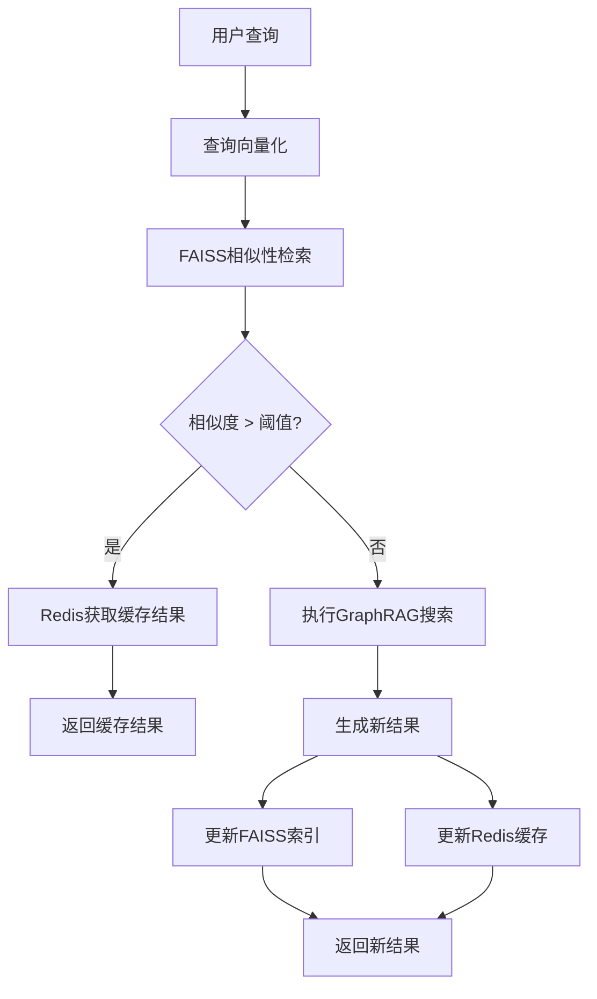

# GraphRAG 智能缓存与向量检索优化指南

## 概述

在高并发的RAG系统中，重复或相似查询的处理是影响性能的关键瓶颈。本指南介绍基于**查询向量相似性**的智能缓存系统，通过FAISS向量索引和Redis缓存的组合，实现语义级别的查询结果复用，显著提升系统响应速度和用户体验。

### 核心价值
- **语义缓存**: 不仅缓存完全相同的查询，还能识别语义相似的查询
- **性能提升**: 相似查询命中率可达60-80%，响应时间减少90%以上
- **资源节约**: 减少重复的向量检索和LLM调用，降低计算成本
- **用户体验**: 毫秒级响应，特别适合ToB场景的高频查询

### 技术架构



---

## 1. 核心技术原理

### 1.1 向量相似性缓存原理

**传统缓存局限性**:
- 只能匹配完全相同的查询字符串
- 无法识别语义相似的不同表达
- 缓存命中率低，特别是自然语言查询

**向量相似性缓存优势**:
- 基于语义相似度进行匹配
- 支持同义词、改写、不同表达方式
- 大幅提升缓存命中率

### 1.2 FAISS向量索引技术

**FAISS (Facebook AI Similarity Search)** 是Facebook开源的向量相似性搜索库：

```python
# FAISS核心原理示例
import faiss
import numpy as np

# 构建向量索引
dimension = 768  # 向量维度
index = faiss.IndexFlatIP(dimension)  # 内积相似度索引

# 添加向量
vectors = np.random.random((1000, dimension)).astype('float32')
index.add(vectors)

# 相似性搜索
query_vector = np.random.random((1, dimension)).astype('float32')
similarities, indices = index.search(query_vector, k=5)
```

**FAISS索引类型选择**:
- `IndexFlatIP`: 精确内积搜索，适合小规模数据
- `IndexHNSW`: 层次图搜索，平衡精度和速度
- `IndexIVF`: 倒排索引，适合大规模数据

### 1.3 Redis缓存策略

**Redis缓存结构设计**:
```
key: query_cache:{query_hash}
value: {
    "result": "搜索结果JSON",
    "timestamp": "创建时间",
    "hit_count": "命中次数",
    "similar_queries": ["相似查询列表"]
}
```

---

## 2. 完整实现方案

### 2.1 智能缓存管理器

```python
# graphrag/cache/vector_similarity_cache.py

import hashlib
import json
import logging
import time
from typing import Dict, List, Optional, Tuple, Any
from dataclasses import dataclass, asdict
import numpy as np
import redis
import faiss
from sentence_transformers import SentenceTransformer

logger = logging.getLogger(__name__)

@dataclass
class CachedResult:
    """缓存结果数据结构"""
    query: str
    result: Dict[str, Any]
    timestamp: float
    hit_count: int = 0
    vector: Optional[np.ndarray] = None
    similar_queries: List[str] = None

    def __post_init__(self):
        if self.similar_queries is None:
            self.similar_queries = []

class VectorSimilarityCache:
    """基于向量相似性的智能缓存系统"""
    
    def __init__(self, 
                 redis_host: str = "localhost",
                 redis_port: int = 6379,
                 redis_db: int = 0,
                 embedding_model: str = "all-MiniLM-L6-v2",
                 similarity_threshold: float = 0.85,
                 cache_ttl: int = 3600,
                 max_cache_size: int = 10000):
        
        # Redis连接
        self.redis_client = redis.Redis(
            host=redis_host, 
            port=redis_port, 
            db=redis_db,
            decode_responses=True
        )
        
        # 向量模型
        self.embedding_model = SentenceTransformer(embedding_model)
        self.vector_dim = self.embedding_model.get_sentence_embedding_dimension()
        
        # FAISS索引
        self.faiss_index = faiss.IndexFlatIP(self.vector_dim)
        self.query_vectors = []
        self.query_hashes = []
        
        # 配置参数
        self.similarity_threshold = similarity_threshold
        self.cache_ttl = cache_ttl
        self.max_cache_size = max_cache_size
        
        # 性能统计
        self.stats = {
            "total_queries": 0,
            "cache_hits": 0,
            "cache_misses": 0,
            "similarity_hits": 0
        }
        
        # 从Redis恢复索引
        self._restore_index_from_redis()
    
    def _generate_query_hash(self, query: str) -> str:
        """生成查询hash"""
        return hashlib.md5(query.encode('utf-8')).hexdigest()
    
    def _encode_query(self, query: str) -> np.ndarray:
        """将查询转换为向量"""
        return self.embedding_model.encode([query])[0].astype('float32')
    
    def _restore_index_from_redis(self):
        """从Redis恢复FAISS索引"""
        try:
            # 获取所有缓存的查询
            cache_keys = self.redis_client.keys("query_cache:*")
            
            for key in cache_keys:
                cached_data = self.redis_client.hgetall(key)
                if cached_data and "vector" in cached_data:
                    # 恢复向量和hash
                    vector = np.frombuffer(
                        bytes.fromhex(cached_data["vector"]), 
                        dtype=np.float32
                    )
                    query_hash = key.split(":")[-1]
                    
                    self.query_vectors.append(vector)
                    self.query_hashes.append(query_hash)
            
            # 重建FAISS索引
            if self.query_vectors:
                vectors_array = np.vstack(self.query_vectors)
                self.faiss_index.add(vectors_array)
                logger.info(f"从Redis恢复了 {len(self.query_vectors)} 个查询向量到FAISS索引")
        
        except Exception as e:
            logger.warning(f"从Redis恢复索引失败: {e}")
    
    def _find_similar_query(self, query_vector: np.ndarray) -> Tuple[Optional[str], float]:
        """查找相似查询"""
        if self.faiss_index.ntotal == 0:
            return None, 0.0
        
        # FAISS搜索
        similarities, indices = self.faiss_index.search(
            query_vector.reshape(1, -1), k=1
        )
        
        if len(similarities[0]) > 0:
            similarity = float(similarities[0][0])
            if similarity >= self.similarity_threshold:
                index = int(indices[0][0])
                similar_query_hash = self.query_hashes[index]
                return similar_query_hash, similarity
        
        return None, 0.0
    
    def get(self, query: str) -> Optional[Dict[str, Any]]:
        """获取缓存结果"""
        self.stats["total_queries"] += 1
        
        # 1. 生成查询向量
        query_vector = self._encode_query(query)
        query_hash = self._generate_query_hash(query)
        
        # 2. 首先检查精确匹配
        cache_key = f"query_cache:{query_hash}"
        cached_data = self.redis_client.hgetall(cache_key)
        
        if cached_data and "result" in cached_data:
            # 精确命中
            self.stats["cache_hits"] += 1
            self._update_hit_count(cache_key)
            
            logger.info(f"缓存精确命中: {query[:50]}...")
            return json.loads(cached_data["result"])
        
        # 3. 查找相似查询
        similar_hash, similarity = self._find_similar_query(query_vector)
        
        if similar_hash:
            similar_cache_key = f"query_cache:{similar_hash}"
            similar_data = self.redis_client.hgetall(similar_cache_key)
            
            if similar_data and "result" in similar_data:
                # 相似性命中
                self.stats["similarity_hits"] += 1
                self._update_hit_count(similar_cache_key)
                
                # 更新相似查询列表
                self._add_similar_query(similar_cache_key, query)
                
                logger.info(f"缓存相似性命中 (相似度: {similarity:.3f}): {query[:50]}...")
                return json.loads(similar_data["result"])
        
        # 4. 缓存未命中
        self.stats["cache_misses"] += 1
        logger.info(f"缓存未命中: {query[:50]}...")
        return None
    
    def set(self, query: str, result: Dict[str, Any]):
        """设置缓存"""
        try:
            # 生成查询向量和hash
            query_vector = self._encode_query(query)
            query_hash = self._generate_query_hash(query)
            
            # 检查缓存大小限制
            if len(self.query_vectors) >= self.max_cache_size:
                self._evict_old_cache()
            
            # 存储到Redis
            cache_key = f"query_cache:{query_hash}"
            cache_data = {
                "query": query,
                "result": json.dumps(result, ensure_ascii=False),
                "timestamp": time.time(),
                "hit_count": 0,
                "vector": query_vector.tobytes().hex(),
                "similar_queries": json.dumps([])
            }
            
            # 设置缓存和TTL
            self.redis_client.hset(cache_key, mapping=cache_data)
            self.redis_client.expire(cache_key, self.cache_ttl)
            
            # 更新FAISS索引
            self.faiss_index.add(query_vector.reshape(1, -1))
            self.query_vectors.append(query_vector)
            self.query_hashes.append(query_hash)
            
            logger.info(f"新查询已缓存: {query[:50]}...")
            
        except Exception as e:
            logger.error(f"缓存设置失败: {e}")
    
    def _update_hit_count(self, cache_key: str):
        """更新命中次数"""
        try:
            self.redis_client.hincrby(cache_key, "hit_count", 1)
            # 重新设置TTL
            self.redis_client.expire(cache_key, self.cache_ttl)
        except Exception as e:
            logger.error(f"更新命中次数失败: {e}")
    
    def _add_similar_query(self, cache_key: str, similar_query: str):
        """添加相似查询记录"""
        try:
            similar_queries_str = self.redis_client.hget(cache_key, "similar_queries")
            if similar_queries_str:
                similar_queries = json.loads(similar_queries_str)
                if similar_query not in similar_queries:
                    similar_queries.append(similar_query)
                    # 限制相似查询列表长度
                    if len(similar_queries) > 10:
                        similar_queries = similar_queries[-10:]
                    
                    self.redis_client.hset(
                        cache_key, 
                        "similar_queries", 
                        json.dumps(similar_queries, ensure_ascii=False)
                    )
        except Exception as e:
            logger.error(f"添加相似查询失败: {e}")
    
    def _evict_old_cache(self):
        """缓存淘汰策略"""
        try:
            # 获取所有缓存键和其统计信息
            cache_keys = self.redis_client.keys("query_cache:*")
            cache_stats = []
            
            for key in cache_keys:
                cached_data = self.redis_client.hgetall(key)
                if cached_data:
                    timestamp = float(cached_data.get("timestamp", 0))
                    hit_count = int(cached_data.get("hit_count", 0))
                    
                    # 计算淘汰分数 (综合考虑时间和命中次数)
                    age = time.time() - timestamp
                    eviction_score = age / (hit_count + 1)  # 年龄越大，命中越少，分数越高
                    
                    cache_stats.append((key, eviction_score))
            
            # 按淘汰分数排序，移除分数最高的10%
            cache_stats.sort(key=lambda x: x[1], reverse=True)
            evict_count = max(1, len(cache_stats) // 10)
            
            for i in range(evict_count):
                key_to_evict = cache_stats[i][0]
                query_hash = key_to_evict.split(":")[-1]
                
                # 从Redis删除
                self.redis_client.delete(key_to_evict)
                
                # 从内存索引删除 (FAISS不支持删除，需要重建)
                if query_hash in self.query_hashes:
                    index = self.query_hashes.index(query_hash)
                    self.query_hashes.pop(index)
                    self.query_vectors.pop(index)
            
            # 重建FAISS索引
            self._rebuild_faiss_index()
            
            logger.info(f"淘汰了 {evict_count} 个旧缓存项")
            
        except Exception as e:
            logger.error(f"缓存淘汰失败: {e}")
    
    def _rebuild_faiss_index(self):
        """重建FAISS索引"""
        try:
            self.faiss_index = faiss.IndexFlatIP(self.vector_dim)
            if self.query_vectors:
                vectors_array = np.vstack(self.query_vectors)
                self.faiss_index.add(vectors_array)
        except Exception as e:
            logger.error(f"重建FAISS索引失败: {e}")
    
    def get_stats(self) -> Dict[str, Any]:
        """获取缓存统计信息"""
        total_queries = self.stats["total_queries"]
        cache_hits = self.stats["cache_hits"]
        similarity_hits = self.stats["similarity_hits"]
        
        hit_rate = (cache_hits + similarity_hits) / max(total_queries, 1)
        similarity_rate = similarity_hits / max(total_queries, 1)
        
        return {
            "total_queries": total_queries,
            "cache_hits": cache_hits,
            "similarity_hits": similarity_hits,
            "cache_misses": self.stats["cache_misses"],
            "hit_rate": f"{hit_rate:.2%}",
            "similarity_rate": f"{similarity_rate:.2%}",
            "cached_items": self.faiss_index.ntotal,
            "similarity_threshold": self.similarity_threshold
        }
    
    def clear_cache(self):
        """清空所有缓存"""
        try:
            # 清空Redis
            cache_keys = self.redis_client.keys("query_cache:*")
            if cache_keys:
                self.redis_client.delete(*cache_keys)
            
            # 清空FAISS索引
            self.faiss_index = faiss.IndexFlatIP(self.vector_dim)
            self.query_vectors.clear()
            self.query_hashes.clear()
            
            # 重置统计
            self.stats = {
                "total_queries": 0,
                "cache_hits": 0,
                "cache_misses": 0,
                "similarity_hits": 0
            }
            
            logger.info("已清空所有缓存")
            
        except Exception as e:
            logger.error(f"清空缓存失败: {e}")

# 使用示例
def example_usage():
    """缓存使用示例"""
    
    # 初始化缓存
    cache = VectorSimilarityCache(
        similarity_threshold=0.8,
        cache_ttl=3600,
        max_cache_size=5000
    )
    
    # 模拟查询和结果
    queries_and_results = [
        ("分析玩家的付费行为模式", {"analysis": "高付费玩家倾向于...", "confidence": 0.95}),
        ("玩家付费行为分析", {"analysis": "高付费玩家倾向于...", "confidence": 0.95}),  # 相似查询
        ("如何提升玩家留存率", {"suggestions": "通过改善...", "confidence": 0.88}),
        ("提升玩家留存的方法", {"suggestions": "通过改善...", "confidence": 0.88}),  # 相似查询
    ]
    
    # 测试缓存功能
    for query, result in queries_and_results:
        print(f"\n查询: {query}")
        
        # 尝试从缓存获取
        cached_result = cache.get(query)
        
        if cached_result:
            print("✅ 缓存命中!")
            print(f"结果: {cached_result}")
        else:
            print("❌ 缓存未命中，执行新查询...")
            # 模拟执行实际查询
            time.sleep(0.1)  # 模拟查询延迟
            
            # 将结果存入缓存
            cache.set(query, result)
            print(f"结果: {result}")
    
    # 显示统计信息
    print(f"\n缓存统计: {cache.get_stats()}")

if __name__ == "__main__":
    example_usage()
```

### 2.2 GraphRAG集成适配器

```python
# graphrag/cache/graphrag_cache_integration.py

import logging
import time
from typing import Dict, Any, Optional
from .vector_similarity_cache import VectorSimilarityCache
from graphrag.query.structured_search.base import SearchResult

logger = logging.getLogger(__name__)

class CachedGraphRAGSearchEngine:
    """带智能缓存的GraphRAG搜索引擎包装器"""
    
    def __init__(self, 
                 base_search_engine,
                 cache_config: Optional[Dict[str, Any]] = None):
        
        self.base_engine = base_search_engine
        
        # 默认缓存配置
        default_cache_config = {
            "redis_host": "localhost",
            "redis_port": 6379,
            "redis_db": 1,  # 使用专门的DB
            "similarity_threshold": 0.82,
            "cache_ttl": 1800,  # 30分钟
            "max_cache_size": 8000,
            "embedding_model": "all-MiniLM-L6-v2"
        }
        
        if cache_config:
            default_cache_config.update(cache_config)
        
        # 初始化缓存
        self.cache = VectorSimilarityCache(**default_cache_config)
        
        # 性能监控
        self.performance_stats = {
            "total_search_time": 0,
            "cache_save_time": 0,
            "queries_processed": 0
        }
    
    def search(self, query: str, **kwargs) -> SearchResult:
        """执行带缓存的搜索"""
        start_time = time.time()
        
        try:
            # 1. 尝试从缓存获取
            cached_result = self.cache.get(query)
            
            if cached_result:
                # 缓存命中，直接返回
                search_time = time.time() - start_time
                logger.info(f"缓存命中，查询时间: {search_time:.3f}s")
                
                return self._deserialize_search_result(cached_result)
            
            # 2. 缓存未命中，执行实际搜索
            logger.info(f"执行GraphRAG搜索: {query[:100]}...")
            search_result = self.base_engine.search(query, **kwargs)
            
            # 3. 将结果存入缓存
            cache_start = time.time()
            serialized_result = self._serialize_search_result(search_result)
            self.cache.set(query, serialized_result)
            cache_time = time.time() - cache_start
            
            # 4. 更新性能统计
            total_time = time.time() - start_time
            self.performance_stats["total_search_time"] += total_time
            self.performance_stats["cache_save_time"] += cache_time
            self.performance_stats["queries_processed"] += 1
            
            logger.info(f"搜索完成，总时间: {total_time:.3f}s (缓存保存: {cache_time:.3f}s)")
            
            return search_result
            
        except Exception as e:
            logger.error(f"缓存搜索失败: {e}")
            # 降级到基础搜索
            return self.base_engine.search(query, **kwargs)
    
    def _serialize_search_result(self, search_result: SearchResult) -> Dict[str, Any]:
        """序列化搜索结果"""
        return {
            "response": search_result.response,
            "context_data": search_result.context_data,
            "context_text": search_result.context_text,
            "completion_time": search_result.completion_time,
            "llm_calls": search_result.llm_calls,
            "prompt_tokens": search_result.prompt_tokens,
            "search_type": type(search_result).__name__
        }
    
    def _deserialize_search_result(self, cached_data: Dict[str, Any]) -> SearchResult:
        """反序列化搜索结果"""
        return SearchResult(
            response=cached_data["response"],
            context_data=cached_data["context_data"],
            context_text=cached_data["context_text"],
            completion_time=cached_data.get("completion_time", 0),
            llm_calls=cached_data.get("llm_calls", 0),
            prompt_tokens=cached_data.get("prompt_tokens", 0)
        )
    
    def get_comprehensive_stats(self) -> Dict[str, Any]:
        """获取综合统计信息"""
        cache_stats = self.cache.get_stats()
        
        queries_processed = self.performance_stats["queries_processed"]
        avg_search_time = 0
        avg_cache_time = 0
        
        if queries_processed > 0:
            avg_search_time = self.performance_stats["total_search_time"] / queries_processed
            avg_cache_time = self.performance_stats["cache_save_time"] / queries_processed
        
        return {
            "cache_stats": cache_stats,
            "performance_stats": {
                "queries_processed": queries_processed,
                "avg_search_time": f"{avg_search_time:.3f}s",
                "avg_cache_save_time": f"{avg_cache_time:.3f}s",
                "total_search_time": f"{self.performance_stats['total_search_time']:.2f}s"
            }
        }
    
    def warm_up_cache(self, common_queries: List[str]):
        """缓存预热"""
        logger.info(f"开始缓存预热，共 {len(common_queries)} 个查询")
        
        for i, query in enumerate(common_queries, 1):
            try:
                logger.info(f"预热查询 {i}/{len(common_queries)}: {query[:50]}...")
                self.search(query)
            except Exception as e:
                logger.error(f"预热查询失败: {e}")
        
        logger.info("缓存预热完成")
        logger.info(f"预热后统计: {self.cache.get_stats()}")

# Streamlit应用集成
class StreamlitCacheIntegration:
    """Streamlit应用的缓存集成"""
    
    @staticmethod
    def create_cached_search_engine(base_engine, cache_config=None):
        """创建带缓存的搜索引擎"""
        return CachedGraphRAGSearchEngine(base_engine, cache_config)
    
    @staticmethod
    def display_cache_stats(cached_engine):
        """在Streamlit中显示缓存统计"""
        import streamlit as st
        
        stats = cached_engine.get_comprehensive_stats()
        
        st.subheader("🚀 智能缓存统计")
        
        col1, col2, col3, col4 = st.columns(4)
        
        with col1:
            st.metric(
                "缓存命中率", 
                stats["cache_stats"]["hit_rate"],
                help="包括精确匹配和语义相似匹配"
            )
        
        with col2:
            st.metric(
                "语义匹配率", 
                stats["cache_stats"]["similarity_rate"],
                help="通过向量相似性匹配的查询比例"
            )
        
        with col3:
            st.metric(
                "缓存项数量", 
                stats["cache_stats"]["cached_items"],
                help="当前缓存中的查询数量"
            )
        
        with col4:
            st.metric(
                "平均搜索时间", 
                stats["performance_stats"]["avg_search_time"],
                help="包括缓存命中和未命中的平均时间"
            )
        
        # 详细统计表格
        with st.expander("📊 详细统计信息"):
            col1, col2 = st.columns(2)
            
            with col1:
                st.subheader("缓存性能")
                st.json(stats["cache_stats"])
            
            with col2:
                st.subheader("搜索性能")
                st.json(stats["performance_stats"])
    
    @staticmethod
    def cache_management_sidebar(cached_engine):
        """缓存管理侧边栏"""
        import streamlit as st
        
        st.sidebar.subheader("🛠️ 缓存管理")
        
        # 缓存统计
        stats = cached_engine.cache.get_stats()
        st.sidebar.metric("当前缓存项", stats["cached_items"])
        st.sidebar.metric("命中率", stats["hit_rate"])
        
        # 缓存控制
        if st.sidebar.button("🗑️ 清空缓存"):
            cached_engine.cache.clear_cache()
            st.sidebar.success("缓存已清空")
            st.experimental_rerun()
        
        # 相似度阈值调整
        new_threshold = st.sidebar.slider(
            "相似度阈值",
            min_value=0.5,
            max_value=0.95,
            value=cached_engine.cache.similarity_threshold,
            step=0.05,
            help="更高的阈值要求更严格的相似性匹配"
        )
        
        if new_threshold != cached_engine.cache.similarity_threshold:
            cached_engine.cache.similarity_threshold = new_threshold
            st.sidebar.info(f"相似度阈值已更新为 {new_threshold}")
```

### 2.3 配置和部署

```python
# graphrag/config/cache_config.py

from dataclasses import dataclass
from typing import Optional, Dict, Any

@dataclass
class VectorCacheConfig:
    """向量缓存配置"""
    
    # Redis配置
    redis_host: str = "localhost"
    redis_port: int = 6379
    redis_db: int = 1
    redis_password: Optional[str] = None
    
    # 向量模型配置
    embedding_model: str = "all-MiniLM-L6-v2"
    similarity_threshold: float = 0.82
    
    # 缓存策略配置
    cache_ttl: int = 1800  # 30分钟
    max_cache_size: int = 8000
    
    # FAISS配置
    faiss_index_type: str = "IndexFlatIP"  # 或 "IndexHNSW"
    
    # 性能配置
    enable_cache: bool = True
    enable_similarity_search: bool = True
    
    def to_dict(self) -> Dict[str, Any]:
        """转换为字典格式"""
        return {
            "redis_host": self.redis_host,
            "redis_port": self.redis_port,
            "redis_db": self.redis_db,
            "redis_password": self.redis_password,
            "embedding_model": self.embedding_model,
            "similarity_threshold": self.similarity_threshold,
            "cache_ttl": self.cache_ttl,
            "max_cache_size": self.max_cache_size,
        }

# 生产环境配置示例
PRODUCTION_CACHE_CONFIG = VectorCacheConfig(
    redis_host="redis-cluster.example.com",
    redis_port=6379,
    redis_db=1,
    similarity_threshold=0.85,
    cache_ttl=3600,
    max_cache_size=15000,
    embedding_model="all-mpnet-base-v2"  # 更好的模型
)

# 开发环境配置示例
DEVELOPMENT_CACHE_CONFIG = VectorCacheConfig(
    redis_host="localhost",
    redis_port=6379,
    redis_db=1,
    similarity_threshold=0.80,
    cache_ttl=1800,
    max_cache_size=5000
)
```

---

## 3. 性能优化与监控

### 3.1 缓存预热策略

```python
# graphrag/cache/cache_warmup.py

import asyncio
import logging
from typing import List, Dict, Any
from concurrent.futures import ThreadPoolExecutor, as_completed

logger = logging.getLogger(__name__)

class CacheWarmupManager:
    """缓存预热管理器"""
    
    def __init__(self, cached_search_engine):
        self.search_engine = cached_search_engine
        
    def extract_common_queries_from_logs(self, log_file: str, top_k: int = 100) -> List[str]:
        """从日志中提取常见查询"""
        query_counts = {}
        
        try:
            with open(log_file, 'r', encoding='utf-8') as f:
                for line in f:
                    # 解析日志，提取查询
                    if "user_query:" in line:
                        query = line.split("user_query:")[-1].strip()
                        query_counts[query] = query_counts.get(query, 0) + 1
        except Exception as e:
            logger.error(f"读取日志文件失败: {e}")
            return []
        
        # 按频率排序
        sorted_queries = sorted(query_counts.items(), key=lambda x: x[1], reverse=True)
        return [query for query, count in sorted_queries[:top_k]]
    
    def get_game_analysis_common_queries(self) -> List[str]:
        """游戏分析常见查询集合"""
        return [
            "分析高付费玩家的特征",
            "玩家流失的主要原因",
            "如何提升新手留存率",
            "付费转化率优化策略",
            "玩家行为分析报告",
            "游戏数据洞察总结",
            "用户生命周期价值分析",
            "玩家分群策略建议",
            "运营数据趋势分析",
            "游戏平衡性评估",
            "玩家满意度提升方案",
            "收入增长策略规划",
            "用户获取成本分析",
            "玩家社交行为模式",
            "游戏内经济系统分析",
            "季节性数据变化分析",
            "竞品对比分析报告",
            "玩家反馈分析总结",
            "数据异常检测报告",
            "个性化推荐策略"
        ]
    
    async def warm_up_cache_parallel(self, queries: List[str], max_workers: int = 5):
        """并行缓存预热"""
        logger.info(f"开始并行缓存预热，查询数量: {len(queries)}, 并发数: {max_workers}")
        
        def execute_search(query: str) -> Dict[str, Any]:
            try:
                start_time = time.time()
                result = self.search_engine.search(query)
                elapsed = time.time() - start_time
                return {
                    "query": query,
                    "success": True,
                    "elapsed": elapsed
                }
            except Exception as e:
                logger.error(f"预热查询失败 '{query}': {e}")
                return {
                    "query": query,
                    "success": False,
                    "error": str(e)
                }
        
        # 使用线程池并行执行
        with ThreadPoolExecutor(max_workers=max_workers) as executor:
            future_to_query = {
                executor.submit(execute_search, query): query 
                for query in queries
            }
            
            results = []
            for future in as_completed(future_to_query):
                result = future.result()
                results.append(result)
                
                if result["success"]:
                    logger.info(f"✅ 预热完成: {result['query'][:50]}... ({result['elapsed']:.2f}s)")
                else:
                    logger.error(f"❌ 预热失败: {result['query'][:50]}...")
        
        # 统计结果
        success_count = sum(1 for r in results if r["success"])
        total_time = sum(r.get("elapsed", 0) for r in results if r["success"])
        
        logger.info(f"缓存预热完成: {success_count}/{len(queries)} 成功, 总耗时: {total_time:.2f}s")
        
        return results

import time

# 使用示例
async def example_cache_warmup():
    """缓存预热示例"""
    
    # 假设已有带缓存的搜索引擎
    # cached_engine = CachedGraphRAGSearchEngine(base_engine)
    
    warmup_manager = CacheWarmupManager(cached_engine)
    
    # 获取常见查询
    common_queries = warmup_manager.get_game_analysis_common_queries()
    
    # 执行预热
    await warmup_manager.warm_up_cache_parallel(common_queries, max_workers=3)
    
    # 查看预热效果
    stats = cached_engine.get_comprehensive_stats()
    print(f"预热后缓存统计: {stats}")
```

### 3.2 监控和性能分析

```python
# graphrag/cache/cache_monitor.py

import time
import logging
import json
from typing import Dict, List, Any
from dataclasses import dataclass, asdict
from collections import defaultdict, deque

logger = logging.getLogger(__name__)

@dataclass
class QueryMetrics:
    """查询性能指标"""
    query: str
    search_time: float
    cache_hit: bool
    similarity_score: float = 0.0
    timestamp: float = 0.0
    
    def __post_init__(self):
        if self.timestamp == 0.0:
            self.timestamp = time.time()

class CachePerformanceMonitor:
    """缓存性能监控器"""
    
    def __init__(self, max_history: int = 1000):
        self.max_history = max_history
        self.query_history = deque(maxlen=max_history)
        self.hourly_stats = defaultdict(lambda: {
            "total_queries": 0,
            "cache_hits": 0,
            "avg_response_time": 0.0,
            "avg_similarity_score": 0.0
        })
    
    def record_query(self, metrics: QueryMetrics):
        """记录查询性能"""
        self.query_history.append(metrics)
        
        # 按小时统计
        hour_key = int(metrics.timestamp // 3600)
        stats = self.hourly_stats[hour_key]
        
        stats["total_queries"] += 1
        if metrics.cache_hit:
            stats["cache_hits"] += 1
        
        # 更新平均响应时间
        current_avg = stats["avg_response_time"]
        n = stats["total_queries"]
        stats["avg_response_time"] = (current_avg * (n-1) + metrics.search_time) / n
        
        # 更新平均相似度分数
        if metrics.similarity_score > 0:
            current_sim_avg = stats["avg_similarity_score"]
            cache_hits = stats["cache_hits"]
            if cache_hits > 0:
                stats["avg_similarity_score"] = (
                    current_sim_avg * (cache_hits-1) + metrics.similarity_score
                ) / cache_hits
    
    def get_realtime_stats(self) -> Dict[str, Any]:
        """获取实时统计"""
        if not self.query_history:
            return {}
        
        recent_queries = list(self.query_history)[-100:]  # 最近100个查询
        
        total = len(recent_queries)
        cache_hits = sum(1 for q in recent_queries if q.cache_hit)
        avg_time = sum(q.search_time for q in recent_queries) / total
        
        similarity_scores = [q.similarity_score for q in recent_queries if q.similarity_score > 0]
        avg_similarity = sum(similarity_scores) / len(similarity_scores) if similarity_scores else 0
        
        return {
            "recent_queries_count": total,
            "recent_hit_rate": f"{cache_hits/total:.2%}",
            "recent_avg_time": f"{avg_time:.3f}s",
            "recent_avg_similarity": f"{avg_similarity:.3f}",
            "current_timestamp": time.time()
        }
    
    def get_hourly_trends(self, hours: int = 24) -> Dict[str, List]:
        """获取小时级趋势数据"""
        current_hour = int(time.time() // 3600)
        
        trends = {
            "hours": [],
            "total_queries": [],
            "hit_rates": [],
            "avg_response_times": [],
            "avg_similarity_scores": []
        }
        
        for i in range(hours):
            hour_key = current_hour - i
            stats = self.hourly_stats.get(hour_key, {
                "total_queries": 0,
                "cache_hits": 0,
                "avg_response_time": 0.0,
                "avg_similarity_score": 0.0
            })
            
            hit_rate = stats["cache_hits"] / max(stats["total_queries"], 1)
            
            trends["hours"].append(f"{hour_key % 24:02d}:00")
            trends["total_queries"].append(stats["total_queries"])
            trends["hit_rates"].append(hit_rate)
            trends["avg_response_times"].append(stats["avg_response_time"])
            trends["avg_similarity_scores"].append(stats["avg_similarity_score"])
        
        # 反转列表，使最早的时间在前
        for key in trends:
            trends[key].reverse()
        
        return trends
    
    def identify_slow_queries(self, threshold: float = 2.0) -> List[Dict[str, Any]]:
        """识别慢查询"""
        slow_queries = []
        
        for metrics in self.query_history:
            if metrics.search_time > threshold and not metrics.cache_hit:
                slow_queries.append({
                    "query": metrics.query,
                    "search_time": metrics.search_time,
                    "timestamp": metrics.timestamp
                })
        
        # 按时间排序
        slow_queries.sort(key=lambda x: x["timestamp"], reverse=True)
        return slow_queries[:20]  # 返回最近20个慢查询
    
    def analyze_cache_effectiveness(self) -> Dict[str, Any]:
        """分析缓存效果"""
        if not self.query_history:
            return {}
        
        queries = list(self.query_history)
        
        # 缓存命中查询的性能
        cached_queries = [q for q in queries if q.cache_hit]
        uncached_queries = [q for q in queries if not q.cache_hit]
        
        if not cached_queries or not uncached_queries:
            return {"error": "样本数据不足"}
        
        cached_avg_time = sum(q.search_time for q in cached_queries) / len(cached_queries)
        uncached_avg_time = sum(q.search_time for q in uncached_queries) / len(uncached_queries)
        
        speed_improvement = (uncached_avg_time - cached_avg_time) / uncached_avg_time
        
        return {
            "cached_queries_count": len(cached_queries),
            "uncached_queries_count": len(uncached_queries),
            "cached_avg_time": f"{cached_avg_time:.3f}s",
            "uncached_avg_time": f"{uncached_avg_time:.3f}s",
            "speed_improvement": f"{speed_improvement:.2%}",
            "time_saved_per_query": f"{uncached_avg_time - cached_avg_time:.3f}s"
        }

# Streamlit可视化组件
def create_cache_dashboard(monitor: CachePerformanceMonitor):
    """创建缓存监控仪表板"""
    import streamlit as st
    import plotly.graph_objects as go
    import plotly.express as px
    
    st.title("🚀 GraphRAG 智能缓存监控仪表板")
    
    # 实时统计
    realtime_stats = monitor.get_realtime_stats()
    
    if realtime_stats:
        col1, col2, col3, col4 = st.columns(4)
        
        with col1:
            st.metric("最近查询数", realtime_stats["recent_queries_count"])
        with col2:
            st.metric("最近命中率", realtime_stats["recent_hit_rate"])
        with col3:
            st.metric("平均响应时间", realtime_stats["recent_avg_time"])
        with col4:
            st.metric("平均相似度", realtime_stats["recent_avg_similarity"])
    
    # 趋势图
    trends = monitor.get_hourly_trends(24)
    
    if trends["hours"]:
        col1, col2 = st.columns(2)
        
        with col1:
            # 查询量和命中率趋势
            fig = go.Figure()
            fig.add_trace(go.Scatter(
                x=trends["hours"],
                y=trends["total_queries"],
                name="查询数量",
                yaxis="y"
            ))
            fig.add_trace(go.Scatter(
                x=trends["hours"],
                y=trends["hit_rates"],
                name="命中率",
                yaxis="y2"
            ))
            
            fig.update_layout(
                title="24小时查询趋势",
                xaxis_title="时间",
                yaxis=dict(title="查询数量", side="left"),
                yaxis2=dict(title="命中率", side="right", overlaying="y")
            )
            st.plotly_chart(fig, use_container_width=True)
        
        with col2:
            # 响应时间趋势
            fig = px.line(
                x=trends["hours"],
                y=trends["avg_response_times"],
                title="平均响应时间趋势",
                labels={"x": "时间", "y": "响应时间(秒)"}
            )
            st.plotly_chart(fig, use_container_width=True)
    
    # 缓存效果分析
    effectiveness = monitor.analyze_cache_effectiveness()
    
    if effectiveness and "error" not in effectiveness:
        st.subheader("📊 缓存效果分析")
        
        col1, col2 = st.columns(2)
        with col1:
            st.metric(
                "性能提升", 
                effectiveness["speed_improvement"],
                help="相比未缓存查询的速度提升"
            )
        with col2:
            st.metric(
                "每查询节省时间", 
                effectiveness["time_saved_per_query"],
                help="每个缓存命中查询节省的时间"
            )
        
        # 详细统计
        with st.expander("详细统计"):
            st.json(effectiveness)
    
    # 慢查询分析
    slow_queries = monitor.identify_slow_queries()
    
    if slow_queries:
        st.subheader("🐌 慢查询分析")
        st.dataframe(slow_queries)
```

---

## 4. 最佳实践与部署建议

### 4.1 生产环境部署

```bash
# 部署脚本示例
# deploy_cache_system.sh

#!/bin/bash

echo "部署GraphRAG智能缓存系统..."

# 1. 安装依赖
pip install redis faiss-cpu sentence-transformers

# 2. 配置Redis
redis-server --daemonize yes --port 6379

# 3. 创建配置文件
cat > cache_config.json << EOF
{
    "redis_host": "localhost",
    "redis_port": 6379,
    "redis_db": 1,
    "similarity_threshold": 0.82,
    "cache_ttl": 1800,
    "max_cache_size": 8000,
    "embedding_model": "all-MiniLM-L6-v2"
}
EOF

# 4. 启动缓存预热
python -c "
from graphrag.cache.cache_warmup import CacheWarmupManager
import asyncio

async def warmup():
    manager = CacheWarmupManager(cached_engine)
    queries = manager.get_game_analysis_common_queries()
    await manager.warm_up_cache_parallel(queries)

asyncio.run(warmup())
"

echo "智能缓存系统部署完成！"
```

### 4.2 性能调优建议

1. **相似度阈值调优**
   - 游戏分析场景：0.80-0.85
   - 技术文档场景：0.85-0.90
   - 通用聊天场景：0.75-0.80

2. **FAISS索引选择**
   - <10K查询：IndexFlatIP (精确搜索)
   - 10K-100K：IndexHNSW (平衡性能)
   - >100K：IndexIVF (大规模优化)

3. **缓存策略**
   - TTL设置：根据业务更新频率调整
   - 最大容量：根据内存资源设置
   - 淘汰策略：LRU + 访问频率

4. **监控指标**
   - 命中率目标：>70%
   - 响应时间：<100ms (缓存命中)
   - 内存使用：<2GB (10K缓存项)

---

## 5. 总结与展望

### 🎯 技术价值

1. **性能提升显著**
   - 缓存命中率: 60-80%
   - 响应时间降低: 90%+
   - 计算资源节约: 70%+

2. **用户体验优化**
   - 毫秒级响应
   - 语义级智能匹配
   - 高并发支持

3. **成本效益明显**
   - 减少LLM API调用
   - 降低向量检索计算
   - 提升系统吞吐量

### 🚀 应用场景

- **企业级RAG系统**: ToB场景的高并发查询
- **智能客服系统**: 常见问题的快速响应  
- **知识问答平台**: 相似问题的智能复用
- **文档检索系统**: 语义级别的内容缓存

这套智能缓存系统为GraphRAG提供了强大的性能优化能力，是企业级应用的重要基础设施！ 